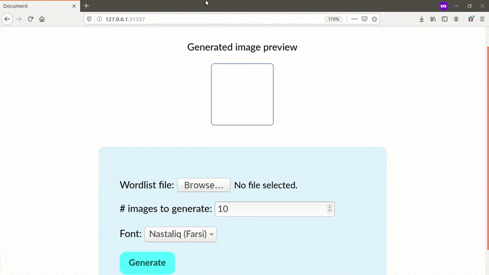

### Table of Content

1. [Introduction](#1-introduction)
2. [(Some) Related Work](#2-some-related-work)
3. [Demo](#3-demo)
4. [Data](#4-data)
5. [Model & Results](#5-model-and-results)
6. [Limitations & Future Work](#6-limitations-and-future-work)
7. [Conclusion](#7-conclusion)
8. [References](#8-references)

### 1. Introduction

The task of font classification/recognition/visual font recognition (VFR), is to automatically identify the font family of an image of text. Since manual font identification can be tedious and requires expertise, especially when working with fonts of foreign languages, automatically identifing these fonts can be of a great benefit to designers and creative workers. In addition to standalone usage of VFR systems to simply identify fonts, they can be utilized as subsystems within other more complex ones, for example:

- Style/similarity-based font search [[3](#8-references)], to power font engines such as [Google Fonts](https://fonts.google.com){:target="_blank"}.

- Improving other tasks, such as optical character recognition (OCR). Identifying the used font in a document then using an OCR model specialized to work with that particular font will improve the accuracy and time complexity of the system, rather than using one model to deal with all the different fonts [[1, 7](#8-references)].

- It can be used as a complementary part of a product. Companies like Google, Snapchat, and Adobe has been interested in this technology in order to increase the productivity of their products' users [[3](#8-references)]. For example, [DeepFont](https://www.youtube.com/watch?v=5eJ3IXYcw3M&t=124){:target="_blank"} was developed as part of Adobe Photoshop to detect and suggest similar fonts from images. MyFonts.com also introduced a tool called [WhatTheFont](https://www.myfonts.com/WhatTheFont/){:target="_blank"} as an on-the-fly font recognition tool.

- It can be used by font creators to detect and find copyright infringements [[7](#8-references)].

This project aims to tackle a simplified version of the font recognition problem. The task is to classify images of text written using Arabic letters into two classes of Arabic fonts: Ruqaa and Nastaliq (Farsi). An Arabic font here refers to a form of writing that uses Arabic letters regardless of the language it's been written in. As shown in [4](#4-data), a dataset was synthesized to solve the data scarcity problem. Additionally, a synthesization process is presented to overcome domain mismatch, a common challenge introduced by synthesized data, in which the training data distribution differs from the testing one, leading to a serious drop in performance. Finally in [5](#5-model-and-results), a model is trained on the mentioned dataset and its performance is analyzed as more synthesization steps were introduced. Results demonstrate the effectiveness of the synthesization process, which alleviates the domain mismatch problem by a factor of 29% allowing the model to reach 97% accuracy.

### 2. (Some) Related Work

Different approaches have been applied to address the VFR problem. Some are based on novel feature extraction techniques [[2](#8-references)], other are deep learning based solutions. Very few work has been done on Arabic VFR, mostly attributed to the lack of data. The only reasonbly sized dataset is the King Fahd Univeristy Arabic Font Database (KAFD) [[4](#8-references)], which is available online, however, at the time of writing the download page renders error messages when requesting to download the dataset, which hindered using it in this project.

In [[1](#8-references)], Tensmeyer et al. train a convolutional neural network (CNN) on KAFD by densely croping each image into patches and then averaging the individual predicitons made on these patches to determine the final decision, which appears to improve performance.

DeepFont [[3](#8-references)] focuses on both data and model. They show how to synthesis data to resemble real world text images. They generate a relatively large sized dataset, which is exploited along with unlabeled real data in an unsupervised way to learn feature maps using Stacked Convolutional Autoencoders (SCAE). These feature maps are then used as an initial state for parts of a CNN trained in a supervised fashion using synthetic data only. This method addresses the domain mismatch problem between training- and prediction-time data.

Since real world Arabic font images are hard to obtain, the main theme of this project is to explore how to properly synthesize such Arabic text images. In particular, the patching method from [[1](#8-references)] was mimicked while creating the dataset. Additionally, the synthesization steps discussed in [4](#4-data) are inspired from [[3](#8-references)].

### 3. Demo

The following is a live demo using Tensorflow.js. Bear in mind that the model was trained on images taken from hand written books, which makes it more performant on such data distribution, rather than on images of street signs for example. To test the model, you can either: 1) generate and synthesize images on-the-fly, 2) upload your own image, or 3) test on sample images.

**Note:** For the demo to work it needs to download 1.99 MB of data.

{::nomarkdown}

Preview

  <canvas id="canvas" width="100" height="100">Your browser doesn't support canvas</canvas>
  

    
Prediction

    
-

    

  

<h6>1. Generate image</h6>

This method requires an Arabic keyboard. Type the desired text in the following text input, then optionally click synthesize to make it look more like real world data. The generated image will be lively previewed on the left as you type. When satisfied click predict to get the final prediction.
  

<label for="input-text" >Text:</label>
<input dir="rtl" type="text" id="input-text" value="نص تجريبي" />
<label for="font-select" >Font:</label>
<select name="font-select" id="font-select">
  <option value="ruqaa" selected>Ruqaa</option>
  <option value="farsi">Nastaliq (Farsi)</option>
</select>
<button id="synthesize-btn">Synthesize</button>

<button id="predict-btn">Predict</button>

  

<h6>2. Upload image</h6> Expects a 100×100px image, larger/smaller images will be scaled to match.
  
<input type="file" id="upload-image" accept="image/jpeg" name="Upload Image" />

  

<h6>3. Test on sample images</h6> Click on an image to make a prediction. Text below each image denotes its true class.
  

  

Nastaliq (Farsi)

  

Nastaliq (Farsi)

  

Nastaliq (Farsi)

  

Nastaliq (Farsi)

  

Nastaliq (Farsi)

  

Ruqaa

  

Ruqaa

  

Ruqaa

  

Ruqaa

  

Ruqaa

 

{:/}

### 4. Data

This section discusses the data problems related to Arabic VFR and the measures taken to solve them.

**<u>Data scarcity</u>** Having a clean real-world representative dataset is the corner stone of success in tackling any machine learning problem. As mentioned earlier, there are no relevant Arabic fonts datasets other than KAFD. Although KAFD is not perfectly suitable for this particular task, it can be used, if available, in unsupervised pretraining. One strong reason for this lack of datasets is that real world data sources for Arabic fonts are not easily accessible. For the task at hand, these resources include old books containing handwritten text in various Arabic fonts. Only a small number of such books are digitalized and made available online, which limits datasets creation only to those who have direct access to physical copies.

Fortunately, I own a book titled *"The Rules of Arabic Calligraphy"* by Hashem Al-Khatat - 1986, which covers 6 Arabic fonts, namely: Thuluth, Nasikh, Nastaliq (Farsi), Diwani, Ruqaa, and Ijaza. Another book I found online is titled *"Ottman Fonts"* by Muhammad Amin Osmanli Ketbkhana, which is most probably written in Turkish back when they used Arabic letters. The fact that these two books are in different languages (the first is in Arabic and the second in Turkish) ensures that the learned model won't be biased towards one langauge or another, which is desierable since classifying fonts is content independent and style dependent. So for example the same word (content) written in two different fonts (style) should be classified into two different classes corresponding to the fonts they were written in.

Eventhough these books cover multiple fonts, however, extracting images from them generates only 250 images per font. This small number of samples makes learning, even when using shallow machine learning models, subject to sever overfitting or in some cases not learning at all, as is the case when using deep models.

Another thing to take into account is that we can only use images of fonts that have available digital typefaces, in order to be able to synthesis data of that particular font. In this work, two fonts satisfy this condition: Ruqaa and Nastaliq (Farsi) with their digital counterparts: [Aref Ruqaa](https://github.com/alif-type/aref-ruqaa){:target="_blank"} and [Iran Nastaliq Web](https://github.com/font-store/font-IranNastaliq){:target="_blank"} respectively. Therefore, our real world data constitutes of 516 images distributed between 2 classes with ~250 images each, which were manually extracted at 200×200px and then resized to 100×100px using GIMP. The text in the extracted images varies in its font size, position, and whether it represents whole or partitions of words.

{::nomarkdown}



{:/}

**<u>Domain Adaptation/Mismatch</u>** Data scarcity motivates the need to synthesis data. Synthesizing data in this context refers to artifical rendering of text images to resembel real world ones. For our purposes, a real world image is an image of a handwritten text using Arabic fonts. An important thing to note is that even if a synthesized image looks to our human eyes similar to a real world one, that doesn't necessarly ensure that it does so from a computer/numeric perspective. For example, in the context of handwritten text, there is a variance in the text color intensity, this variance has many sources such as the dryness of ink as the calligrapher writes or due to paper aging. These slight variations don't affect our human ability to recognize text and its font, however, if not taken into account while synthesizing data, they can lead to significant degradation in machine learning models' performance. From this example we can see that synthesizing data is a challenging and detail sensetive process.

{::nomarkdown}



{:/}

In this work, four main steps were applied to ensure that synthesized data is as close as possible to real one. These steps are as follows:

1. Generated images have a randomly chosen background from a set of 48 images. Some of these backgrounds were taken from the books mentioned above and others from Unsplash.com. Adding these backgrounds makes the generated images look as if they were written on paper. The opacity of the selected background is randomized as well.

2. Out of the 48 backgrounds, only 33 contain transparent text from the page beneeth it. The remainder 15 don't contain any transparent text. For the latter images, a random word is taken from a word list without replacement and its color intensity is set randomly within a certain range to make it look as if it was transparent. The font type, size, and position of the selected word are all randomized as well. The used word list is a cleaned (words containing english letters and punctuations were removed) version of the [CNN word list](https://github.com/mhmoodlan/arabic-font-classification/releases/tag/v0.1.0){:target="_blank"}.

3. A random number is chosen in the range [1, 3] representing the number of words to be rendered. These words are randomly chosen from the word list without replacement to prevent word repetition, which produces small sentences that don't make any semantical sense. This is preferable since the choice of words and their placement in the sentence don't contribute to the type of font used. The position, intensity of color, and font size of the chosen words are all chosen randomly as well.

4. Gaussian noise and jpeg quality reduction are applied to synthesized images. Finally, all images are converted to grayscale before training.

The following figure visualizes these steps on a sample image and compare it to a real image of the same text.

{::nomarkdown}



<button id="fig3-ctrls-play" class="controls-play play">Play</button>
<button id="fig3-ctrls-pause" class="controls-pause pause">Pause</button>
<button id="fig3-ctrls-restart" class="controls-restart restart">Restart</button>
<input type="range" min="0" max="100" value="0" step="0.001" class="progress controls-progress"></input>

{:/}

A simple web app was developed to generate these images. Given a word list file, the number of images to generate, and the type of font to use, the app will generate and automatically download the synthesized images. Here's a snapshot of it in action:

{::nomarkdown}

The developed synthesization tool. Generated images are named using UNIX timestamps of their creation time. When finished, a new word list excluding the words that were used in the generation proccess will be saved, which allows for subsequent runs without word duplicates.

   

Sample of the synthesized images



{:/}

**<u>Dataset details</u>** 20,000 images were generated from each class, Ruqaa and Nastaliq (Farsi), creating a dataset of 40,000 synthesized image. When combined with the previous 516 real image, the final dataset contains 40,516 images, which will be refered to as RuFa dataset.

The dataset is splitted into 4 subsets during experimentation (validation mode): training, validation, data-mismatch, and testing subsets. The training and validation subsets are composed of synthesized data. The data-mismatch and testing subsets are composed of real data. When all the hyperparameters are tuned to their final values (testing mode), the model is retrained on the train, val, and data-mismatch subsets, and then its final performance is measured on the test set. The following figure describes dataset splitting.

{::nomarkdown}



{:/}

The dataset can be downloaded from [this repository](https://github.com/mhmoodlan/arabic-font-classification/releases/tag/v0.1.0){:target="_blank"}.

### 5. Model and Results

The used model is a 3-layer Convolutional Neural Network (CNN) with 10% dropout followed by a 2-layer fully connected network with 20% dropout and an output layer with one sigmoid neuron for binary classification. An Adam optimizer was used to train the model using binary crossentropy as the loss function. Accuracy was used as a performance measure since the dataset is well balanced. The specific architecture is summarized in the following figure:

{::nomarkdown}



{:/}

The performance of the model was measured as more synthesization steps were added. At first, the model was trained with basic synthesization. The model's performance on the validation set approaches 99% in all cases, implying absence of overfitting, however, the performance drops significantly when evaluated on real data, namely the mismatch and test sets, which indicates a domain mismatch problem. Previously discussed synthesization steps successfully close this gap allowing the model to adapt from the synthesized data domain to the real data domain. The following figure shows the progression of performance as more synthesization steps were added:

{::nomarkdown}



{:/}

### 6. Limitations and Future Work

The following are some of the limitations of this work and suggestions on how to overcome them.

- The developed system can only handle binary classification, a future direction would be to extend it to work with multiple fonts. An even more sophisticated system would support multilabel classification where each image might contain multiple fonts.

- The current setup handles cropped patches of a page well, but not an entire page at once. A preprocessing pipeline could be added to handle this case by automatically identifying text lines on a page then patching and sending them to the current model to make predictions on a page level.

- The dataset contains text written using a computer font. In reality, a handwritten text can have calligraphic extensions to add decoration. The dataset can be extended to include such cases, which will be reflected on the model's performance and generalization capacity.

- One of the advantages of this work is the architecture simplicity of the model. However, one direction of improvement might be in designing more advanced architectures. For example:

  - Unsupervised pretraining of the model on large datasets like KAFD.

  - Since VFR is concerned with the style of an image despite its content, a style-content decomposition approach can be taken. For instance, extracting style representations of a font using techniques such as Neural Style Transfer [[6](#8-references)], then feeding those learned representations to a neural network for classification.

  - CNNs are invariant to the position of text in the image. However, they are sensitive to its scale. One way to overcome this is through data augmentation, which is what was used here by randomly determining the size of synthesized text, producing a variety of text sizes. An alternative solution on the model side would be to use invariance CNNs [[5](#8-references)].

  - Employing Autoencoders to remove background noise, then using these clean images for classification.

- Lastely, on the product side, we can enhance the product design and user experience by implementing ways for the users to correct errors or suggest solutions and feed this information back to the model as a form of online learning. Such systems are usually called [collaborative AI systems](https://medium.com/@Ben_Reinhardt/designing-collaborative-ai-5c1e8dbc8810){:target="_blank"}.

### 7. Conclusion

This work shows that even with advanced frameworks that are designed to make large parts of developing machine learning systems accessible, and even when considering a simple task such as binary font classification, there are still many challenges to be addressed in order to develop a useable system, such as data scarcity and domain mismatch.

In this project, a dataset of 40,516 images was created consisting of 40,000 synthesized images and 516 real images. A data synthesization process was presented and analyized to overcome the domain mismatch problem. The dataset is available for download [from this repo](https://github.com/mhmoodlan/arabic-font-classification/releases/tag/v0.1.0){:target="_blank"}. To reproduce results presented here and to further explore the dataset, you can . Finally, a [codebase](https://github.com/mhmoodlan/arabic-font-classification/){:target="_blank"} organizing the training and deployment code is open-sourced.

### 8. References

1. Tensmeyer, Chris, Daniel Saunders, and Tony Martinez. ["Convolutional neural networks for font classification."](https://ieeexplore.ieee.org/document/8270095){:target="_blank"} 2017 14th IAPR international conference on document analysis and recognition (ICDAR). Vol. 1. IEEE, 2017.

2. Chen, Guang, et al. ["Large-scale visual font recognition."](https://openaccess.thecvf.com/content_cvpr_2014/html/Chen_Large-Scale_Visual_Font_2014_CVPR_paper.html){:target="_blank"} Proceedings of the IEEE Conference on Computer Vision and Pattern Recognition. 2014.

3. Wang, Zhangyang, et al. ["Deepfont: Identify your font from an image."](https://arxiv.org/pdf/1507.03196.pdf){:target="_blank"} Proceedings of the 23rd ACM international conference on Multimedia. 2015.

4. Luqman, Hamzah, Sabri Mahmoud, and Sameh Awaida. [KAFD: Arabic Font Database](https://catalog.ldc.upenn.edu/LDC2016T21){:target="_blank"} LDC2016T21. Hard Drive. Philadelphia: Linguistic Data Consortium, 2016.

5. Xu, Yichong, et al. ["Scale-invariant convolutional neural networks."](https://arxiv.org/abs/1411.6369){:target="_blank"} arXiv preprint arXiv:1411.6369 (2014).

6. Gatys, Leon A., Alexander S. Ecker, and Matthias Bethge. ["A neural algorithm of artistic style."](https://arxiv.org/abs/1508.06576){:target="_blank"} arXiv preprint arXiv:1508.06576 (2015).

7. Wang, Yizhi, et al. ["Font recognition in natural images via transfer learning."](http://www.icst.pku.edu.cn/zlian/docs/20181024110641005904.pdf){:target="_blank"} International conference on multimedia modeling. Springer, Cham, 2018.
